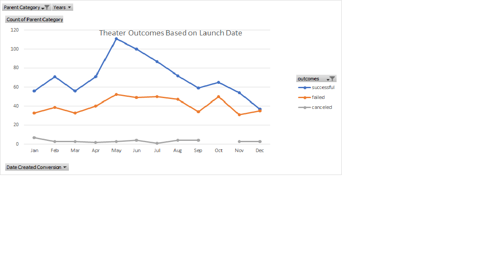
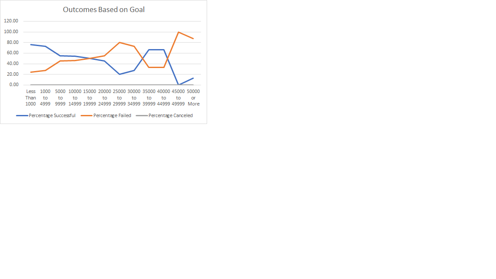

# Kickstarting with Excel

## Overview of Project
The purpose of this research was to provide an analysis of theater and play events based on time and fundraising goals so Louise can make educated decisions about future projects. 

### Purpose
The purpose of this analysis is so Louise can gauge when she should start her crownfunding campaign for her play and the best amount she should ask for to be successful. 

## Analysis and Challenges
I performed this analysis by filtering the data for theatre and plays to find out the number of successful, failed, and canceled events by month and goals. 

### Analysis of Outcomes Based on Launch Date
The analysis for outcomes based on launch date resulted in fining May, June, and July had the most successful fundraising campaigns. The failed campaings hovered around 40 between 34 and 52 and was pretty evenly spread throughout all the months of the year. There were 0-7 canceled campaigns which is an insignificant number in comparison to the rest of the data.
 

### Analysis of Outcomes Based on Goals
Through my anaylsis for outcomes based on goal I found that the most successful goal ranges are less than $1,000 - $4,999 and $35,000 - $44,999. The lease successful goal ranges are $25,000 - $34,999 and $45,000 and up. 
 

### Challenges and Difficulties Encountered
A challenge I encountered when finding the theater outcomes based on launch date was how to configure the pivot table with the proper data. Another challenge was filling out COUNTIFS formulas into the outcomes based on goal chart. 

## Results
- What are two conclusions you can draw about the Outcomes based on Launch Date?
The best time of year for crowdfunding is May through July. 
The worst time of year for crowndfunging is November through March

- What can you conclude about the Outcomes based on Goals?
The most successful crowdfunding goal ranges are $1,000 - $4999 and $35,000 - $44,999.
- What are some limitations of this dataset?
A limitiation of this dataset is that most of it is data from the US and if Louise is planning on doing any projects in GB, there may not be enough data pretaining to GB. 
- What are some other possible tables and/or graphs that we could create?
A box and whisker plot my be helpful to see how the data is skewed. 
